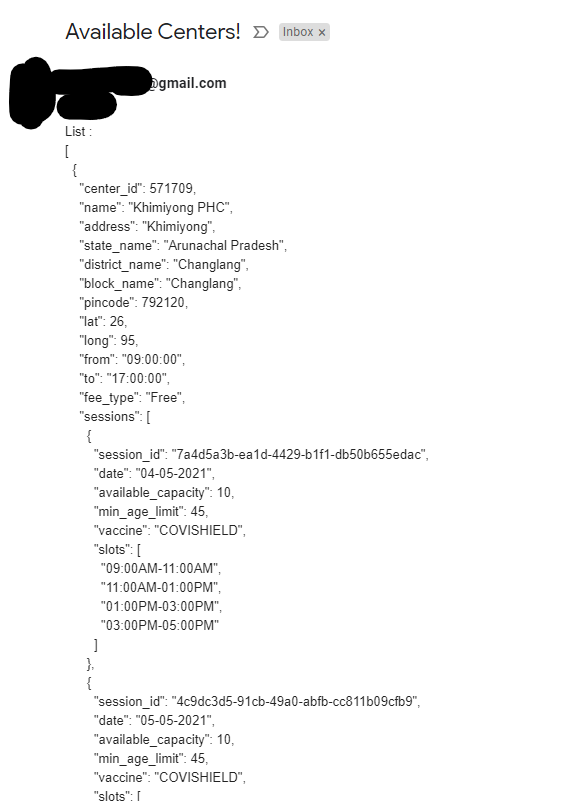
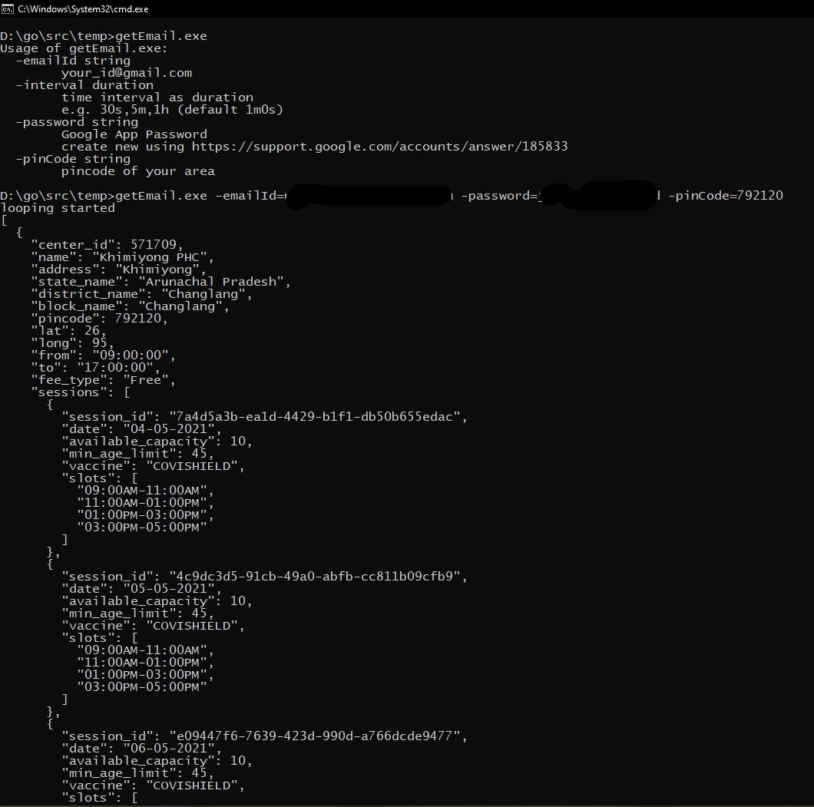

Info
---
This tool uses [CoWIN Protected APIs](https://apisetu.gov.in/public/marketplace/api/cowin/cowin-protected-v2). But not sure, Slots response is real time

Pre Requisite
---
* Beneficiaries are added
* Same dose either __first for all Beneficiaries__ OR __second for all__
* Ready to put/enter OTP every 15 mins

Usage
---
go run main.go model.go -h

go run main.go model.go -emailId=your_id@gmail.com -password=app_password -pincode=411001,411002 -to=email_1,email_2,email_3 -mobileNumber=XXXXX12345

* Create App Password Using https://support.google.com/accounts/answer/185833

Output
---

